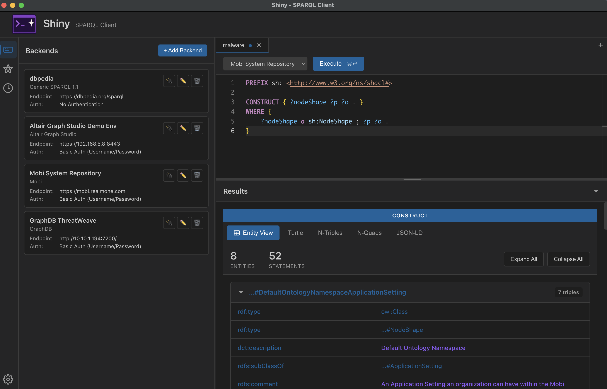

# Shiny - Extensible SPARQL Client

A modern, secure Electron-based SPARQL client built with Vue 3 and TypeScript. Features a VS Code-style interface, multi-backend support, comprehensive authentication, and encrypted credential storage.

A SPARQL utility knife for navigating the world of Enterprise Knowledge Graph.




## Features

### Core Capabilities ✅

**Multi-Backend Management**

- Create and manage multiple SPARQL endpoint configurations
- Switch between backends with a dropdown selector
- Extensible provider system supporting multiple backend types:
  - Generic SPARQL 1.1 (fully implemented)
  - Altair Graph Studio (fully implemented - graphmart/layer selection)
  - Mobi (fully implemented - catalogs, repositories, records, branches)
  - Ontotext GraphDB (fully implemented - GDB token auth, inference control)
  - AWS Neptune (stub for future implementation)
  - Stardog (stub for future implementation)

**Comprehensive Authentication**

- **None** - Public endpoints without authentication
- **Basic Auth** - Username/password with Base64 encoding
- **Bearer Token** - JWT or API token authentication
- **Custom Headers** - Dynamic key-value header pairs for custom auth schemes

**Secure Credential Storage**

- OS-level encryption using Electron's `safeStorage` API
  - macOS: Keychain
  - Windows: DPAPI (Data Protection API)
  - Linux: libsecret
- Credentials never exposed to renderer process
- Decryption only occurs in main process during query execution

**Modern UI**

- VS Code-style icon sidebar with sliding drawer
- Resizable panels (200-600px) with smooth animations
- Monaco editor for SPARQL query editing
- Keyboard shortcuts (Cmd/Ctrl+Enter to execute)
- Automatic dark mode support

**Query History**

- Full implementation with persistence
- Search and replay past queries
- Session restoration on app restart

**AI-Assisted Query Generation**

- Chat agent with tool calling support
- Context-aware query suggestions
- Natural language to SPARQL conversion

**Export Capabilities**

- JSON, CSV export for tabular data
- RDF serialization: Turtle, N-Triples, N-Quads, JSON-LD
- Copy to clipboard support

**Results Visualization**

- Tabular view with sorting and filtering
- Entity view for exploring individual resources
- Multiple format display options

**Tab Management**

- Multi-tab editor interface
- Session restoration (tabs persist across restarts)
- Cmd/Ctrl+W to close current tab
- Tab reordering and management

**File Operations**

- Open .rq/.sparql files from disk
- Save queries to files (Cmd/Ctrl+S)
- Drag-and-drop file support

**Ontology Cache System**

- Caching with configurable queries
- Manual refresh controls
- Backend-specific cache management

**Settings & Configuration**

- Query settings (timeout, result limits)
- Prefix management for common namespaces
- SPARQL formatting preferences
- AI configuration options

### Planned Features

- SPARQL editor enhancements (autocomplete, syntax validation)
- Network graph visualization for RDF data
- Query profiling and performance metrics
- Federated query support
- Plugin system for extensibility

## Screenshots

_Coming soon_

## Project Structure

```
shiny/
├── packages/
│   ├── main/                      # Electron main process (Node.js)
│   │   ├── src/
│   │   │   ├── backends/          # Backend provider system
│   │   │   │   ├── providers/     # BaseProvider, Sparql11Provider, etc.
│   │   │   │   │   ├── BaseProvider.ts
│   │   │   │   │   ├── Sparql11Provider.ts
│   │   │   │   │   ├── GraphStudioProvider.ts
│   │   │   │   │   ├── MobiProvider.ts
│   │   │   │   │   └── GraphDBProvider.ts
│   │   │   │   ├── BackendFactory.ts
│   │   │   │   └── types.ts
│   │   │   ├── services/          # Business logic
│   │   │   │   ├── BackendService.ts      # Backend CRUD
│   │   │   │   ├── CredentialService.ts   # Encrypted storage
│   │   │   │   ├── MigrationService.ts    # Data migrations
│   │   │   │   ├── FileService.ts         # File operations
│   │   │   │   └── OntologyCacheService.ts # Ontology caching
│   │   │   ├── ipc/               # IPC handlers
│   │   │   │   ├── backends.ts    # Backend management
│   │   │   │   ├── query.ts       # Query execution
│   │   │   │   ├── files.ts       # File operations
│   │   │   │   ├── graphstudio.ts # Graph Studio API
│   │   │   │   ├── mobi.ts        # Mobi API
│   │   │   │   ├── graphdb.ts     # GraphDB API
│   │   │   │   └── ontologyCache.ts # Cache management
│   │   │   ├── index.ts           # Main entry point
│   │   │   └── window.ts          # Window management
│   │   └── package.json
│   │
│   ├── preload/                   # Preload scripts (security bridge)
│   │   ├── src/
│   │   │   └── index.ts           # Secure IPC bridge
│   │   └── package.json
│   │
│   └── renderer/                  # Vue 3 frontend application
│       ├── src/
│       │   ├── components/
│       │   │   ├── sidebar/       # VS Code-style sidebar
│       │   │   │   ├── IconSidebar.vue
│       │   │   │   ├── SidebarIconBar.vue
│       │   │   │   ├── SidebarDrawer.vue
│       │   │   │   ├── DrawerResizer.vue
│       │   │   │   ├── icons/     # ConnectionIcon, AIIcon, HistoryIcon, SettingsIcon
│       │   │   │   └── panels/    # ConnectionPanel, HistoryPanel, AIPanel, SettingsPanel
│       │   │   ├── editor/        # Monaco/CodeMirror SPARQL editor
│       │   │   │   └── EditorTabs.vue
│       │   │   ├── results/       # Query results display
│       │   │   │   ├── ResultsView.vue
│       │   │   │   ├── TableView.vue
│       │   │   │   └── EntityView.vue
│       │   │   ├── settings/      # Settings panels
│       │   │   │   ├── QuerySettings.vue
│       │   │   │   ├── PrefixSettings.vue
│       │   │   │   ├── FormatSettings.vue
│       │   │   │   └── AISettings.vue
│       │   │   └── layout/        # TopBar, MainPane
│       │   ├── stores/            # Pinia state management
│       │   │   ├── connection.ts  # Backend management
│       │   │   ├── sidebar.ts     # Sidebar UI state
│       │   │   ├── query.ts       # Query execution
│       │   │   ├── tabs.ts        # Tab management
│       │   │   ├── history.ts     # Query history
│       │   │   ├── aiChat.ts      # AI chat state
│       │   │   └── ontologyCache.ts # Cache state
│       │   ├── types/             # TypeScript definitions
│       │   ├── composables/       # Reusable Vue logic
│       │   │   ├── useFileDragDrop.ts
│       │   │   ├── useFileOperations.ts
│       │   │   ├── useResultsSave.ts
│       │   │   ├── useCacheRefresh.ts
│       │   │   ├── useGraphStudio.ts
│       │   │   ├── useMobi.ts
│       │   │   └── useGraphDB.ts
│       │   └── App.vue
│       └── package.json
│
├── scripts/                       # Build and development scripts
│   ├── dev.js                     # Development server
│   └── build.js                   # Production build
│
└── package.json                   # Root workspace configuration
```

## Getting Started

### Prerequisites

- Node.js >= 18.0.0
- npm >= 9.0.0

### Installation

1. Clone the repository:

```bash
git clone https://github.com/yourusername/shiny.git
cd shiny
```

2. Install dependencies:

```bash
npm install
```

This will install dependencies for all workspace packages (main, preload, renderer).

### Development

Start the development server with hot-reload:

```bash
npm run dev
```

This will:

1. Compile TypeScript for main and preload processes in watch mode
2. Start Vite dev server for the renderer process
3. Launch Electron with automatic reloading

The app will automatically create a default DBpedia backend on first run.

### Building for Production

Build the application for your platform:

```bash
npm run build
```

This will create distributable packages in the `dist/` directory using electron-builder.

**macOS Users**: The builds are not code-signed with an Apple Developer ID. When you first open the app, macOS Gatekeeper will show a "damaged" error. To open the app:

1. Right-click (or Control-click) on the app in Finder
2. Select "Open" from the context menu
3. Click "Open" in the dialog that appears

Alternatively, you can allow the app via System Settings:

```bash
# Remove quarantine attribute
xattr -d com.apple.quarantine /Applications/Shiny.app
```

After the first time, the app will open normally.

### Other Commands

```bash
npm run lint           # Lint TypeScript and Vue files
npm run lint:fix       # Lint and auto-fix issues
npm run type-check     # Type check without emitting files
npm run clean          # Remove all build artifacts
npm run format         # Format code with Prettier
npm run format:check   # Check formatting without changes
npm test               # Run all tests
npm run test:run       # Run tests once (no watch)
npm run test:ui        # Run tests with Vitest UI
npm run test:coverage  # Run tests with coverage report
npm run bump-version   # Bump version across all packages
```

## Architecture

### Security Model

**Process Isolation**

- Main process (Node.js): Full system access, runs backend logic and IPC handlers
- Preload process: Security bridge, exposes limited API to renderer
- Renderer process: Sandboxed, runs Vue application with no Node.js access

**Security Features**

- Context isolation enabled
- Node integration disabled in renderer
- `contextBridge` API for secure IPC
- Input validation on all IPC messages
- Sender frame validation
- OS-level credential encryption

### Backend Provider System

The provider pattern enables extensible backend support:

```typescript
// All providers implement this interface
interface BackendProvider {
  type: BackendType
  execute(
    config: BackendConfig,
    query: string,
    credentials?: BackendCredentials
  ): Promise<QueryResult>
  validate(config: BackendConfig): Promise<ValidationResult>
}

// Base class handles common logic (auth headers, error handling)
abstract class BaseProvider implements BackendProvider {
  protected getAuthHeaders(
    config: BackendConfig,
    credentials?: BackendCredentials
  ): Record<string, string> {
    // Unified auth header generation for all providers
  }
}

// Concrete implementations
class Sparql11Provider extends BaseProvider {
  async execute(config, query, credentials) {
    // SPARQL 1.1 Protocol implementation
  }
}
```

Adding a new backend type:

1. Implement provider class extending `BaseProvider`
2. Register in `BackendFactory`
3. Add UI options in ConnectionForm

### Query Execution Flow

```
User clicks "Execute" in UI
  ↓
QueryStore.executeQuery()
  ↓
IPC: window.electronAPI.query.execute(query, backendId)
  ↓
Main Process Handler:
  1. Load BackendConfig from electron-store
  2. Decrypt credentials using safeStorage
  3. Get provider from BackendFactory.getProvider(config.type)
  4. Provider executes query with auth headers
  5. Parse and validate response
  ↓
Results returned to renderer and displayed
```

### Data Storage

**electron-store Structure:**

```json
{
  "backends": [
    {
      "id": "uuid-...",
      "name": "DBpedia",
      "type": "sparql-1.1",
      "endpoint": "https://dbpedia.org/sparql",
      "authType": "none",
      "createdAt": 1234567890,
      "updatedAt": 1234567890
    }
  ],
  "credentials": {
    "uuid-...": "<encrypted-base64-string>"
  },
  "selectedBackendId": "uuid-...",
  "schemaVersion": 1
}
```

- **backends**: Plaintext configs (non-sensitive metadata)
- **credentials**: Encrypted credentials per backend
- **selectedBackendId**: Currently active backend
- **schemaVersion**: For future migrations

### Technology Stack

**Core Technologies**

- **Runtime**: Electron 29 (Chromium 122, Node.js 20)
- **Frontend Framework**: Vue 3 (Composition API + `<script setup>`)
- **Language**: TypeScript 5.3
- **State Management**: Pinia (Vue 3 native store)
- **Build Tool**: Vite 5 (fast HMR, native ESM)

**Key Libraries**

- **Code Editors**: Monaco Editor, CodeMirror 6
- **HTTP Client**: Axios (with auth interceptors)
- **Session Management**: axios-cookiejar-support, tough-cookie
- **SPARQL Parser**: sparqljs (query type detection)
- **RDF Processing**: @rdfjs/dataset, @rdfjs/parser-n3, @rdfjs/serializer-jsonld, @rdfjs/serializer-turtle, @rdfjs/serializer-ntriples, rdf-ext
- **Storage**: electron-store (persistent configuration)
- **Encryption**: Electron safeStorage (OS keychain/DPAPI)
- **UUID Generation**: uuid

**Development Tools**

- **Type Checking**: TypeScript strict mode
- **Linting**: ESLint + @typescript-eslint
- **Formatting**: Prettier
- **Testing**: Vitest, @vue/test-utils, happy-dom, @vitest/coverage-v8, @vitest/ui
- **Build**: electron-builder (packaging and distribution)
- **Process Management**: Concurrently (parallel dev processes)

## Development Roadmap

### ✅ Phase 1: Foundation (Complete)

- Electron + Vue 3 + TypeScript monorepo structure
- Basic SPARQL query execution
- Monaco editor integration
- UI layout foundation

### ✅ Phase 2: Multi-Backend System (Complete)

- Backend provider architecture with factory pattern
- CRUD operations for backend configurations
- Generic SPARQL 1.1 provider with full auth support
- Encrypted credential storage using OS keychain
- Secure IPC layer with validation
- Migration system for seamless upgrades

### ✅ Phase 3: UI/UX Improvements (Complete)

- VS Code-style icon sidebar with resizable drawer
- Backend management UI (list, create, edit, delete, test)
- Form validation and error handling
- Smooth animations and transitions
- Backend selection dropdown in query interface

### ✅ Phase 4: Enterprise Backend Support (Complete)

- Altair Graph Studio provider (graphmart/layer selection)
- Mobi provider (catalogs, repositories, records, branches)
- Ontotext GraphDB provider (GDB token auth, inference control)
- Backend-specific configuration forms

### ✅ Phase 5: Editor & Tab System (Complete)

- Multi-tab editor interface with session persistence
- File operations (open, save, drag-and-drop)
- SPARQL formatting and beautification
- Keyboard shortcuts (Cmd/Ctrl+W, Cmd/Ctrl+S, Cmd/Ctrl+O)

### ✅ Phase 6: Results & Export (Complete)

- Tabular results view with sorting and filtering
- Entity view for exploring individual resources
- RDF serialization (Turtle, N-Triples, N-Quads, JSON-LD)
- Export to multiple formats (JSON, CSV)

### ✅ Phase 7: History & AI (Complete)

- Query history with persistence and search
- AI chat assistant with tool calling support
- Natural language to SPARQL conversion
- Context-aware query suggestions

### ✅ Phase 8: Settings & Configuration (Complete)

- Settings panels system
- Query settings (timeout, result limits)
- Prefix management for common namespaces
- AI configuration options

### 🚧 Phase 9: Advanced Features (In Progress)

- AWS Neptune provider implementation
- Stardog provider implementation
- Network graph visualization for RDF data
- Query profiling and performance metrics
- Federated query support

### 📋 Phase 10: Polish & Distribution (Planned)

- Comprehensive documentation
- User guides and tutorials
- CI/CD pipeline improvements
- Code signing and notarization
- Public releases (GitHub, website)

## Configuration

### First Run

On first launch, Shiny automatically creates a default backend pointing to DBpedia's public SPARQL endpoint. You can:

1. Click the connection icon in the left sidebar
2. Add, edit, or delete backends
3. Test connections before saving
4. Select your active backend from the dropdown

### Managing Backends

**Create a new backend:**

1. Open the Connections panel (left sidebar icon)
2. Click "Add Backend"
3. Fill in the form:
   - **Name**: Descriptive label (e.g., "Production Stardog")
   - **Type**: Select backend type
   - **Endpoint**: SPARQL endpoint URL
   - **Auth Type**: Choose authentication method
   - **Credentials**: Enter auth details (if applicable)
4. Click "Create"

**Test a connection:**

- Click the 🔌 icon on any backend card
- Results display for 5 seconds (success/error)

**Edit or delete:**

- Click ✏️ to edit backend configuration
- Click 🗑️ to delete (with confirmation prompt)

### Keyboard Shortcuts

- `Cmd/Ctrl+Enter`: Execute query
- `Cmd/Ctrl+W`: Close current tab
- `Cmd/Ctrl+S`: Save current file
- `Cmd/Ctrl+O`: Open file

## Contributing

Contributions are welcome! Please follow these guidelines:

1. Fork the repository
2. Create a feature branch (`git checkout -b feature/amazing-feature`)
3. Commit your changes (`git commit -m 'Add amazing feature'`)
4. Push to the branch (`git push origin feature/amazing-feature`)
5. Open a Pull Request

### Development Guidelines

- Follow TypeScript strict mode conventions
- Use Vue 3 Composition API with `<script setup>`
- Maintain security best practices (no credential leaks, input validation)
- Add comments for complex logic
- Update tests when adding features

## Troubleshooting

### Port Already in Use

If Vite fails to start due to port 5173 being in use:

```bash
# Find and kill the process
lsof -ti:5173 | xargs kill -9
```

### Encryption Not Available

On Linux, if safeStorage is not available:

```bash
# Install libsecret
sudo apt-get install libsecret-1-dev  # Debian/Ubuntu
sudo dnf install libsecret-devel      # Fedora
```

### TypeScript Errors

If you encounter TypeScript errors after pulling:

```bash
npm run clean
npm install
```

## Security

### Reporting Security Issues

Please report security vulnerabilities to [your-email]. Do not open public issues for security concerns.

### Security Features

- **Credential Encryption**: All passwords and tokens encrypted with OS-level keychain
- **Process Isolation**: Renderer process runs in sandbox with no Node.js access
- **IPC Validation**: All inter-process messages validated and sanitized
- **No Credential Logging**: Credentials never logged or displayed in UI
- **Secure Updates**: Update verification and code signing (coming in Phase 7)

## License

MIT License - see [LICENSE](LICENSE) for details

## Acknowledgments

- Built with [Electron](https://www.electronjs.org/), [Vue 3](https://vuejs.org/), and [TypeScript](https://www.typescriptlang.org/)
- Monaco Editor by [Microsoft](https://microsoft.github.io/monaco-editor/)
- Inspired by VS Code's UI/UX patterns
- SPARQL parsing by [sparqljs](https://github.com/RubenVerborgh/SPARQL.js)

## Support

- 📖 Documentation: [Coming soon]
- 🐛 Bug Reports: [GitHub Issues](https://github.com/yourusername/shiny/issues)
- 💬 Discussions: [GitHub Discussions](https://github.com/yourusername/shiny/discussions)
- 📧 Email: [your-email]

---

**Note**: Shiny is under active development. Features and APIs may change. Star the repository to stay updated!
